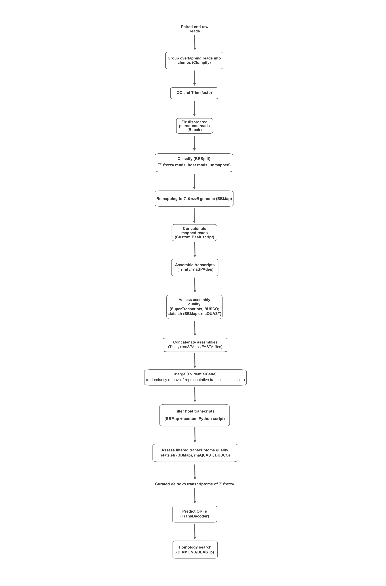

# De Novo Transcriptome Assembly Pipeline for *Thecaphora frezzii*

This repository contains the bioinformatic pipeline used to reconstruct and curate a high-quality de novo transcriptome of the peanut smut fungus *Thecaphora frezzii* from RNA-seq data

The pipeline includes RNA-seq preprocessing, host-pathogen read classification, fungal read recovery, de novo transcriptome assembly, transcriptome quality assessment, transcriptome curation, host transcript filtering, ORF prediction, and protein homology searches.

## Workflow



## Repository structure

```text
docs/
    Pipeline figures

scripts/
    Custom Bash and Python scripts

config/
    Configuration files

resources/
    Reference genomes and annotation databases

results/
    Example outputs
```

## Software

The workflow was implemented using BBTools, fastp, Trinity, rnaSPAdes, EvidentialGene, BUSCO, rnaQUAST, TransDecoder, DIAMOND, Python and standard Unix command-line utilities including wget, gunzip, unzip and pigz.

## Citation

Manuscript under review.

## Contact

## Contact

María Cecilia Merino  
INIMEC-CONICET–UNC, Córdoba, Argentina  
Email: cmerino@immf.uncor.edu
